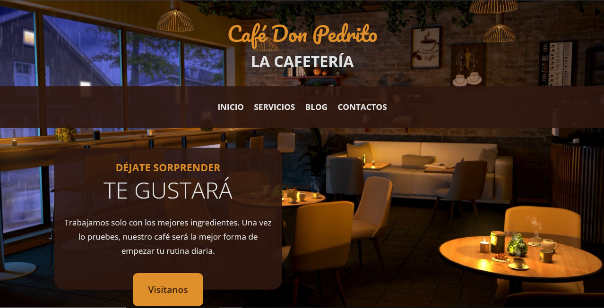

# 🎨 Práctica: Landing Page para una cafetería

La landing page cuenta con: navbar, hero con video de fondo, productos mas vendidos, nuevos productos, menú, galería, ubicación del negocio con maps y un pie de página con las redes sociales de la cafetería.

En está practica inicializamos los estilos por defecto, definimos variables para los colores y textos, creamos estilos de utilidad para componentes que se repiten, añadimos animaciones a botonos y enlaces; ademas ocupamos media queries y grid para hacer responsiva la landing page.

## 🚀 Tecnologías utilizadas

- HTML5
- CSS3 (Flexbox y Grid)
- Google Fonts
- Boxicons

## 📸 Demo

👉 [Ver página en línea](#)

