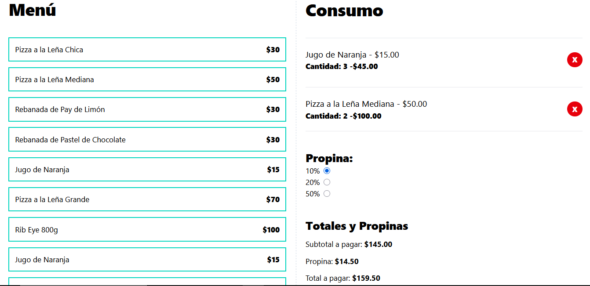

# Calculadora de Propinas y Consumo 

Este proyecto es una calculadora de propinas y consumo desarrollada con React, TypeScript y TailwindCSS.

## 📌 Características principales

- Menu de productos con sus precios para seleccionar y añadir al consumo.

- En el consumo se listan los pedidos con el precio por la cantidad de productos más el subtotal de todos los productos en general.

- Al seleccionar el porcentaje de propina se calcula automático la propina y el total a pagar.

- Al guardar la orden se reinicia el estado para comenzar una nueva orden.

## 🔑 Tipado y organización

- Se definieron types para: los datos, los props de los componentes y los métodos, incluyendo tanto sus parámetros como los valores de retorno.

- Para el estado de la orden se usó un genérico en useState que asegura consistencia en los tipos.

- Las definiciones reutilizables se centralizaron en index.ts (archivo de types).

- Se creó un custom hook para encapsular la lógica del consumo.

- Se añadió un archivo helpers para formatear montos en dólares (formatCurrency).

## 📸 Demo

👉 [Ver página en línea](#)

