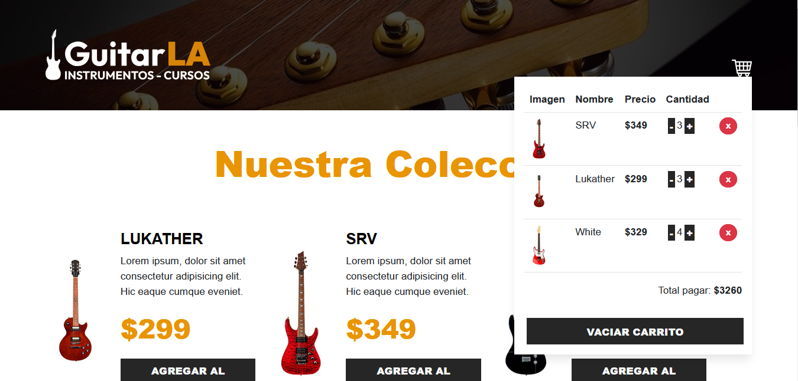

# 🛒 Carrito de Compras en React

Este proyecto es la migración de un carrito de compras sencillo, originalmente desarrollado con HTML y Bootstrap, hacia una implementación en React.
## 📌 Características principales

- Los productos se cargan desde el archivo db.js y se renderizan en los componentes utilizando .map().
- Toda la lógica del carrito se encapsuló en un custom hook (useCart), lo que permite que los componentes se enfoquen únicamente en mostrar la información.
- Se emplean useState para manejar:
    - El estado de los datos provenientes de db.js.
    - El estado del carrito (cart), que se actualiza al añadir o modificar productos.
- Se utiliza useMemo para calcular automáticamente el total de la compra cada vez que el carrito cambia.
- Con useEffect, el carrito se guarda en localStorage de forma persistente cada vez que se modifica.

## ✅ Beneficios de la migración

- Separación clara entre lógica y presentación.
- Persistencia de datos en el navegador.
- Código modular y reutilizable gracias a los hooks personalizados.
- Mejor experiencia de usuario con control de cantidades y actualización automática del total.

## 🧩 Conceptos clave

- useState → Guardar y actualizar valores que cambian.
- useEffect → Ejecutar acciones secundarias cuando cambian valores o al montar el componente.
- useMemo → Optimizar cálculos para que solo se hagan cuando es necesario.

## 📸 Demo

👉 [Ver página en línea](#)

