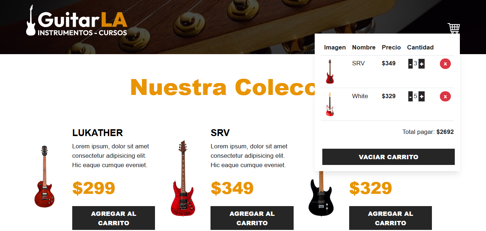

# 🛒 Carrito de Compras en React + TypeScript

Este proyecto es la migración de un carrito de compras previamente desarrollado en React con JavaScript hacia una implementación en React con TypeScript.

## 📌 Características principales

- Se definieron types para:
  - Los datos de la base (db.js → ahora tipados).
  - Los props de los componentes.
  - Los métodos, incluyendo tanto sus parámetros como los valores de retorno.

- Para los types reutilizables, se creó un archivo centralizado que facilita la organización y evita duplicaciones.

- Se aplicó herencia de types en el carrito (Cart), ya que este contiene los datos de la guitarra más una propiedad adicional (quantity).

## ✅ Beneficios de la migración

- Código más seguro y robusto gracias al tipado estático.
- Mejor autocompletado e IntelliSense en el editor.
- Reducción de errores en tiempo de ejecución al validar parámetros y retornos.
- Reutilización y organización clara de los types en un archivo dedicado.
- Flexibilidad al extender tipos mediante herencia, adaptando estructuras existentes a nuevas necesidades.

## 🧩 Conceptos clave

- Types → Definen la forma de los datos y aseguran consistencia en props y funciones.
- Archivo de types → Centraliza definiciones que se usan en múltiples lugares.
- Herencia de types → Permite extender estructuras existentes (ejemplo: Cart hereda de Guitar y añade quantity).

## 📸 Demo

👉 [Ver página en línea](#)

